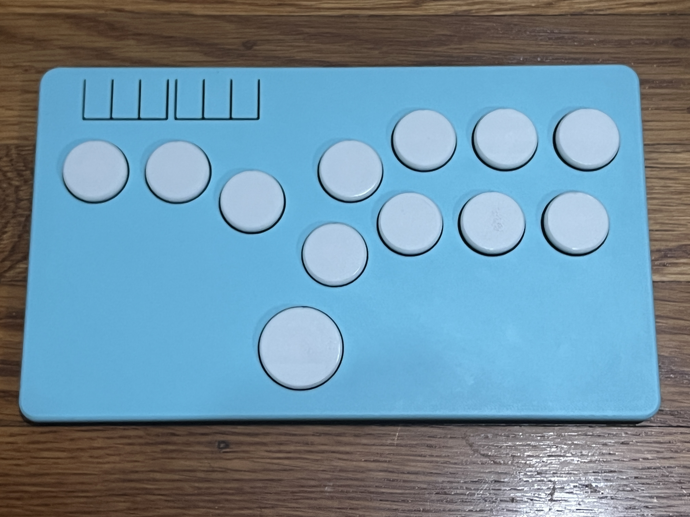
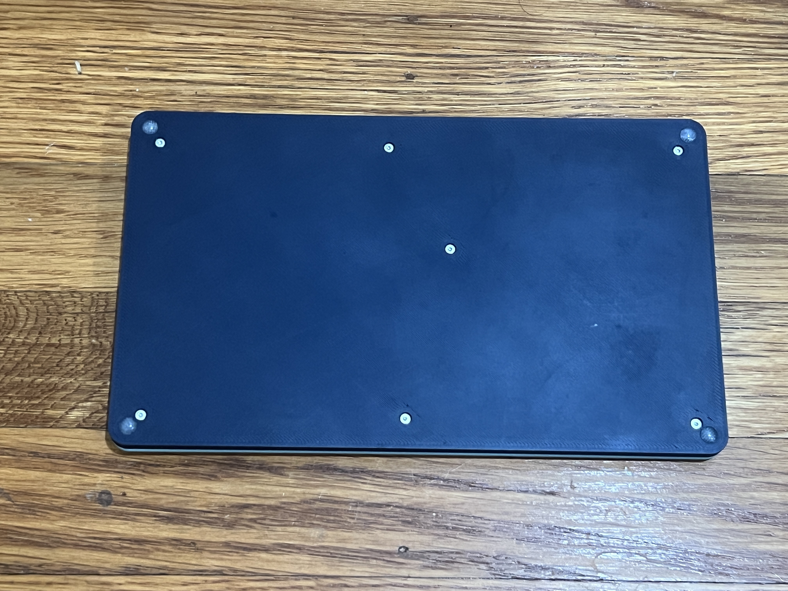
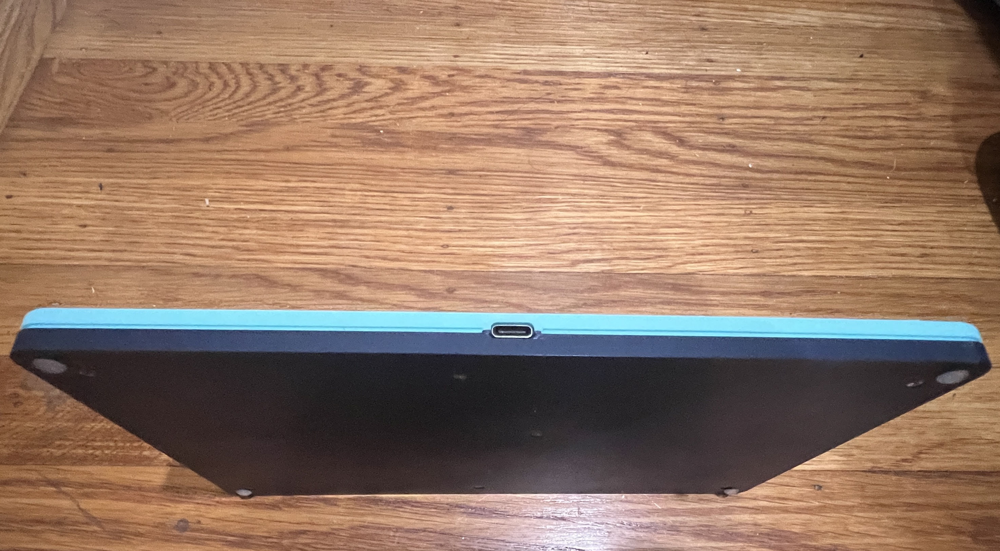

# Flatbox
These cases are modified versions of the Flatbox originally by [jfedor](https://github.com/jfedor2/flatbox). This project was originally inspired by SGF Devices's [Bridget](https://github.com/sgfdevices/Bridget) and remixes their designed buttons and heatset insert design.

The focus of this design was to improve long term use, especially with repeated assembly and disassembly. Using heatset inserts over directly screwing into plastic is the main improvement. For aesthetic purposes, a shadow line was added to the part so that gaps between the cases from the imperfections of 3D printing aren't visible. You may need to tune your filament flow depending on how dialed in your printer is. All parts don't need supports.

So far, I've made a version of the Rev3 and Rev4. The cases work with the stock Flatbox PCBs.
  
QTY | Name | Source | Alternative
------- | ------------------------- | --------------------- | ---------------------
1 | Case Top | 3D printed | N/A
1 | Case Bottom | 3D printed | N/A
11 | 24mm Button | 3D printed | N/A
1 | 30mm Button | 3D printed | N/A
12 | Kailh Choc Switches | [Mechanical Keyboards](https://mechanicalkeyboards.com/shop/index.php?l=product_detail&p=6337) | [Aliexpress](https://www.aliexpress.us/item/3256804880270570.html)
1 | [PCB](https://github.com/jfedor2/flatbox/tree/master) | [JLCPCB](https://jlcpcb.com) | [PCBWay](https://www.pcbway.com)
1 | REV3 ONLY: [Brook PS3/PS4 Board](https://www.brookaccessory.com/detail/58690501) | [Amazon](https://www.amazon.com/Brook-PC-Fight-Board-Fighting-Function/dp/B01A29YQ1M) | [FocusAttack](https://focusattack.com/brook-ps3-ps4-fight-board-pcba)
7 | M2 Heatset Insert | [Amazon](https://www.amazon.com/AIEX-Printing-Embedment-Automotive-M2x3x3-5mm/dp/B0B8GN63S2) | [McMaster-Carr](https://www.mcmaster.com/94459A120)
7 | M2 x 5 or 6mm Flat Head Screws | [Amazon](https://www.amazon.com/s?k=m2x6mm+flat+head+screws&crid=2LFWHBOWVENA0&sprefix=m2x6mm+flat+head+screw%2Caps%2C132) | [McMaster-Carr](https://www.mcmaster.com/92125A052)
